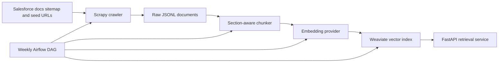

# Salesforce Docs RAG Agent

Production-grade retrieval infrastructure over public Salesforce documentation, aimed at senior data engineering and AI platform interviews.

The system crawls public Salesforce docs, chunks content by documentation section, embeds chunks, stores vectors in Weaviate, and exposes a FastAPI semantic retrieval API with filters for product area, documentation type, release version, and source URL.

## Architecture



## What This Demonstrates

- Public documentation ingestion with Scrapy, sitemap discovery, and structured metadata extraction.
- Semantic chunking by headings so retrieved passages preserve product and section context.
- Pluggable embeddings: OpenAI `text-embedding-3-small` for production, deterministic local vectors for tests and offline demos.
- Weaviate vector storage with metadata filters and REST retrieval through FastAPI.
- Weekly Airflow refresh DAG for changed documentation indexing.
- Docker Compose local deployment.

## Quick Start

```bash
cp .env.example .env
python3 -m venv .venv
source .venv/bin/activate
make install
docker compose up -d weaviate
make crawl
make chunk
make index
make api
```

Open [http://localhost:8000/docs](http://localhost:8000/docs) for Swagger.

For the demo UI, keep the API running and start Streamlit in another terminal:

```bash
make ui
```

Open [http://localhost:8501](http://localhost:8501).

The Streamlit app supports two runtime modes:

- `FastAPI` mode: set `RAG_API_BASE_URL=http://localhost:8000`; Streamlit calls the API.
- `Direct` mode: leave `RAG_API_BASE_URL` unset; Streamlit connects directly to Weaviate and OpenAI. This is the Streamlit Community Cloud deployment mode.

## Streamlit Community Cloud Demo

For a public demo, host `streamlit_app.py` on [Streamlit Community Cloud](https://streamlit.io/cloud). Community Cloud installs dependencies from `requirements.txt` and lets you paste secrets into app settings instead of committing credentials.

1. Push this repo to GitHub.
2. Create or use a Weaviate Cloud cluster and load the `SalesforceDocChunk` collection with indexed chunks.
3. In Streamlit Community Cloud, create a new app with:
   - Repository: your GitHub repo
   - Branch: your working branch
   - Main file path: `streamlit_app.py`
4. In the app's secrets settings, paste values like `.streamlit/secrets.toml.example`.

Required Streamlit secrets:

```toml
OPENAI_API_KEY = "..."
WEAVIATE_URL = "https://your-cluster.weaviate.network"
WEAVIATE_API_KEY = "..."
WEAVIATE_COLLECTION = "SalesforceDocChunk"
EMBEDDING_PROVIDER = "openai"
ANSWER_PROVIDER = "openai"
```

Do not commit `.streamlit/secrets.toml`; only commit `.streamlit/secrets.toml.example`.

To load the current local corpus into Weaviate Cloud, temporarily set `WEAVIATE_URL` and `WEAVIATE_API_KEY` to your cloud cluster values and run:

```bash
make index
```

That reuses `data/processed/salesforce_doc_chunks.jsonl`, creates the collection if needed, embeds chunks with OpenAI, and upserts vectors into Weaviate Cloud. After that, Streamlit Community Cloud can query the hosted collection directly.

## Example Query

```bash
curl -X POST http://localhost:8000/query \
  -H "Content-Type: application/json" \
  -d '{
    "query": "How do I set up identity resolution in Data Cloud?",
    "top_k": 5,
    "filters": {"product_area": "Data Cloud"}
  }'
```

## Example Grounded Answer

```bash
curl -X POST http://localhost:8000/answer \
  -H "Content-Type: application/json" \
  -d '{
    "query": "How do I write Apex tests?",
    "top_k": 3
  }'
```

`/answer` retrieves Salesforce documentation chunks first, then returns a grounded answer with citations. By default it uses deterministic local synthesis; set `ANSWER_PROVIDER=openai` and `OPENAI_API_KEY` for LLM-generated answers.

## Retrieval Evaluation

Run labeled retrieval checks against the current Weaviate index:

```bash
python scripts/evaluate_retrieval.py --top-k 5
python scripts/evaluate_retrieval.py --top-k 5 --candidate-k 25 --rerank
```

The script reports hit rate and MRR so you can compare local embeddings, OpenAI embeddings, and hybrid reranking.

## Airflow Refresh Pipeline

Airflow runs the production-style refresh flow on a weekly schedule:

```bash
make airflow-init
make airflow-up
```

Open [http://localhost:8081](http://localhost:8081) and log in with `admin` / `admin`. The `salesforce_docs_weekly_refresh` DAG runs:

```text
crawl_docs -> chunk_docs -> index_docs -> summarize_refresh
```

The final task reports raw document count, chunk count, indexed chunk count, and the Weaviate collection. Airflow services run in Docker; the project data directory is mounted into the containers so the same `data/` files are refreshed.

## Repository Layout

- `src/salesforce_docs_rag/crawler`: HTML extraction, URL classification, Scrapy item models.
- `src/salesforce_docs_rag/chunking`: Section-aware chunking that preserves headers and metadata.
- `src/salesforce_docs_rag/embeddings`: OpenAI and deterministic local embedding providers.
- `src/salesforce_docs_rag/storage`: Weaviate schema, upsert, and semantic search.
- `src/salesforce_docs_rag/api`: FastAPI app and request/response models.
- `streamlit_app.py`: Lightweight demo UI over the FastAPI `/answer` endpoint.
- `scrapy_project`: Crawlable Scrapy project wrapper.
- `dags`: Airflow weekly refresh DAG.
- `tests`: Unit tests for extraction, chunking, embeddings, and API contracts.

## Production Notes

For a real portfolio run, switch `EMBEDDING_PROVIDER=openai`, set `OPENAI_API_KEY`, raise `MAX_PAGES`, and schedule the Airflow DAG. The local embedding provider is intentionally deterministic so the project can be tested without paid services.

Airflow is packaged as an optional extra because its dependency constraints are heavier than the API and crawler:

```bash
python3 -m pip install -e ".[airflow]"
```
