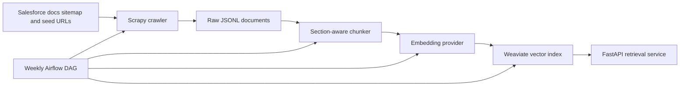

# Salesforce Docs RAG Agent

Production-grade retrieval infrastructure over public Salesforce documentation, aimed at senior data engineering and AI platform interviews.

The system crawls public Salesforce docs, chunks content by documentation section, embeds chunks, stores vectors in Weaviate, and exposes a FastAPI semantic retrieval API with filters for product area, documentation type, release version, and source URL.

## Architecture



## What This Demonstrates

- Public documentation ingestion with Scrapy, sitemap discovery, and structured metadata extraction.
- Semantic chunking by headings so retrieved passages preserve product and section context.
- Pluggable embeddings: OpenAI `text-embedding-3-small` for production, deterministic local vectors for tests and offline demos.
- Weaviate vector storage with metadata filters and REST retrieval through FastAPI.
- Weekly Airflow refresh DAG for changed documentation indexing.
- Docker Compose local deployment.

## Quick Start

```bash
cp .env.example .env
python3 -m venv .venv
source .venv/bin/activate
make install
docker compose up -d weaviate
make crawl
make chunk
make index
make api
```

Open [http://localhost:8000/docs](http://localhost:8000/docs) for Swagger.

## Example Query

```bash
curl -X POST http://localhost:8000/query \
  -H "Content-Type: application/json" \
  -d '{
    "query": "How do I set up identity resolution in Data Cloud?",
    "top_k": 5,
    "filters": {"product_area": "Data Cloud"}
  }'
```

## Repository Layout

- `src/salesforce_docs_rag/crawler`: HTML extraction, URL classification, Scrapy item models.
- `src/salesforce_docs_rag/chunking`: Section-aware chunking that preserves headers and metadata.
- `src/salesforce_docs_rag/embeddings`: OpenAI and deterministic local embedding providers.
- `src/salesforce_docs_rag/storage`: Weaviate schema, upsert, and semantic search.
- `src/salesforce_docs_rag/api`: FastAPI app and request/response models.
- `scrapy_project`: Crawlable Scrapy project wrapper.
- `dags`: Airflow weekly refresh DAG.
- `tests`: Unit tests for extraction, chunking, embeddings, and API contracts.

## Production Notes

For a real portfolio run, switch `EMBEDDING_PROVIDER=openai`, set `OPENAI_API_KEY`, raise `MAX_PAGES`, and schedule the Airflow DAG. The local embedding provider is intentionally deterministic so the project can be tested without paid services.

Airflow is packaged as an optional extra because its dependency constraints are heavier than the API and crawler:

```bash
python3 -m pip install -e ".[airflow]"
```
